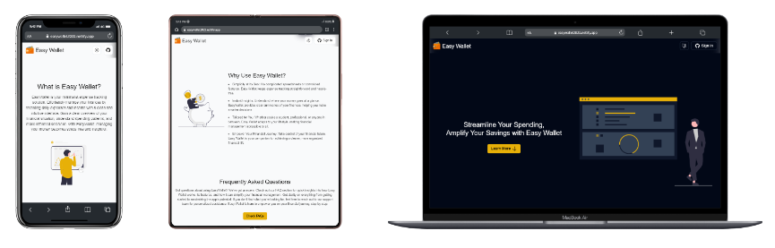

[![Contributors][contributors-shield]][contributors-url]
[![Forks][forks-shield]][forks-url]
[![Stargazers][stars-shield]][stars-url]
[![Issues][issues-shield]][issues-url]
[![MIT License][license-shield]][license-url]

<!-- PROJECT LOGO -->
<br />
<div align="center">
  

  <h3 align="center">Easy Wallet</h3>

  <p align="center">
    This is the front end application of the Easy Wallet project, a web application that helps you to manage your finances.
  <br />
    <strong>Status: <u>Development</u>

  </strong>
    <br />
    <a href="#"><strong>Explore the docs »</strong></a>
    <br />
    <a href="https://easy-wallet-fe.onrender.com">View Demo</a>
    ·
    <a href="https://github.com/TiagoRibeiro25/Easy-Wallet-FE/issues">Report Bug</a>
    ·
    <a href="https://github.com/TiagoRibeiro25/Easy-Wallet-FE/issues">Request Feature</a>
  </p>
   
 <br />
</div>

<!-- TABLE OF CONTENTS -->
<details>
  <summary>Table of Contents</summary>
  <ol>
    <li>
      <a href="#about-the-project">About The Project</a>
      <ul>
        <li><a href="#built-with">Built With</a></li>
      </ul>
    </li>
    <li>
      <a href="#getting-started">Getting Started</a>
      <ul>
        <li><a href="#prerequisites">Prerequisites</a></li>
        <li><a href="#installation">Installation</a></li>
       <li><a href="#prepare-for-production">Prepare for production</a></li>
      </ul>
    </li>
    <li><a href="#contributing">Contributing</a></li>
    <li><a href="#license">License</a></li>
    <li><a href="#contact">Contact</a></li>
  </ol>
</details>

<!-- ABOUT THE PROJECT -->
## About The Project

Easy Wallet is a web application that allows users to manage their finances. It was made with the purpose of helping people to organize their money and to have a better understanding of their expenses and incomes.

This project was made as a side project with the purpose of getting familiar with the technologies used in the development of the application.

### Built With

* [Vue](https://vuejs.org/)
* [Tailwind](https://tailwindcss.com/)
* [TypeScript](https://www.typescriptlang.org/)
* [Pinia](https://pinia.esm.dev/)
* [Axios](https://axios-http.com/)
* [Vite](https://vitejs.dev/)

<!-- GETTING STARTED -->
## Getting Started

To get a local copy up and running follow these simple steps.

### Prerequisites

In order to run this project, you need to have installed

* Nodejs and npm
* Have this [project](https://github.com/TiagoRibeiro25/Easy-Wallet-BE) running locally or in a server

### Installation

1. Clone the repo

   ```sh
   git clone https://github.com/TiagoRibeiro25/Easy-Wallet-FE.git
   ```

2. Install NPM packages

3. Create a .env file, add the variables in the .env.example file and fill them with your own values.

4. Have the [back end](https://github.com/TiagoRibeiro25/Easy-Wallet-FE.git) running locally or in a server

5. Run the project

   ```sh
   npm run dev
   ```

<!-- Production -->
## Prepare for production

1. Install the dependencies

   ```sh
   npm install
   ```

2. Build the project

   ```sh
   npm run build
   ```

3. Set the environment variables in the .env.example file

4. Use a server to serve the files in the dist folder

<!-- CONTRIBUTING -->
## Contributing

Contributions are what make the open source community such an amazing place to learn, inspire, and create. Any contributions you make are **greatly appreciated**.

If you have a suggestion that would make this better, please fork the repo and create a pull request. You can also simply open an issue with the tag "enhancement".

1. Fork the Project
2. Create your Feature Branch (`git checkout -b feature/AmazingFeature`)
3. Commit your Changes (`git commit -m 'Add some AmazingFeature'`)
4. Push to the Branch (`git push origin feature/AmazingFeature`)
5. Open a Pull Request

<!-- LICENSE -->
## License

Distributed under the MIT License. See `LICENSE.txt` for more information.

<!-- CONTACT -->
## Contact

Contact through my [personal website](https://tiagoribeiro.tech/contact).

<!-- MARKDOWN LINKS & IMAGES -->
[contributors-shield]: https://img.shields.io/github/contributors/TiagoRibeiro25/Easy-Wallet-FE.svg?style=for-the-badge
[contributors-url]: https://github.com/TiagoRibeiro25/Easy-Wallet-FE/graphs/contributors
[forks-shield]: https://img.shields.io/github/forks/TiagoRibeiro25/Easy-Wallet-FE.svg?style=for-the-badge
[forks-url]: https://github.com/TiagoRibeiro25/Easy-Wallet-FE/network/members
[stars-shield]: https://img.shields.io/github/stars/TiagoRibeiro25/Easy-Wallet-FE.svg?style=for-the-badge
[stars-url]: https://github.com/TiagoRibeiro25/Easy-Wallet-FE/stargazers
[issues-shield]: https://img.shields.io/github/issues/TiagoRibeiro25/Easy-Wallet-FE.svg?style=for-the-badge
[issues-url]: https://github.com/TiagoRibeiro25/Easy-Wallet-FE/issues
[license-shield]: https://img.shields.io/github/license/TiagoRibeiro25/Easy-Wallet-FE.svg?style=for-the-badge
[license-url]: https://github.com/TiagoRibeiro25/Easy-Wallet-FE/blob/master/LICENSE.txt
